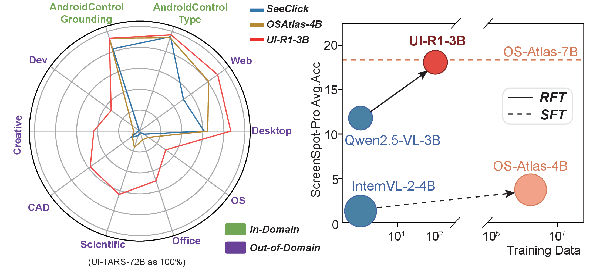
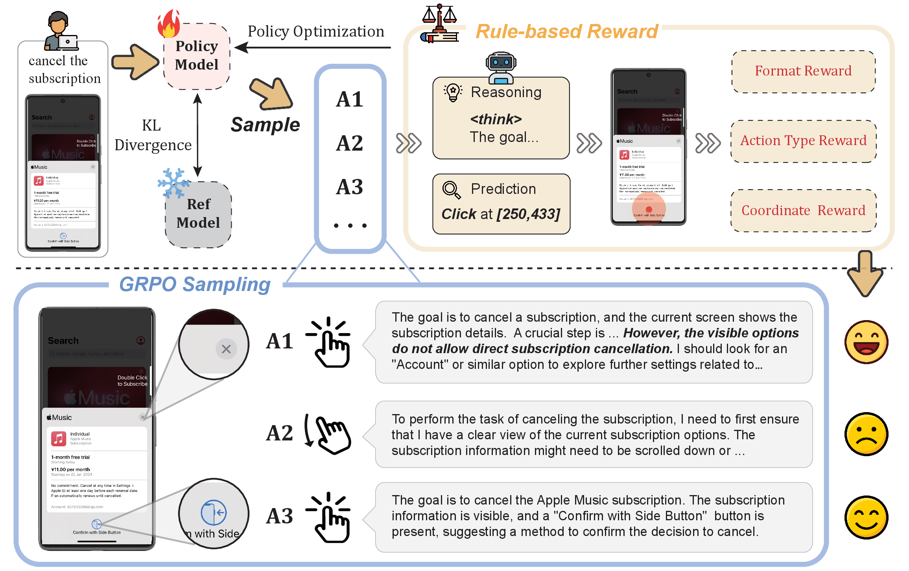

# UI-R1: Enhancing Action Prediction of GUI Agents by Reinforcement Learning

<font size=4><div align='center' > [[📖 Paper](https://arxiv.org/abs/2503.21620)] [[🤗 Checkpoints](https://huggingface.co/LZXzju/Qwen2.5-VL-3B-UI-R1)] [[🤗 Datasets](https://huggingface.co/datasets/LZXzju/UI-R1-3B-Train)] [[🤗 Daily Paper](https://huggingface.co/papers/2503.21620)]</div></font>

## 🔥 Overview

We propose **UI-R1**, the first framework to explore how rule-based RL can enhance the reasoning capabilities of multimodal large language models (MLLMs) for GUI action prediction tasks.

<a href="">
  
</a>

Experimental results demonstrate that our proposed **UI-R1-3B** achieves significant improvements over the base model (i.e. Qwen2.5-VL-3B) on both in-domain (ID) and out-of-domain (OOD) tasks, with average accuracy gains of **22.1%** on ScreenSpot, **6.0%** on ScreenSpot-Pro, and **12.7%** on AndroidControl. Furthermore, UI-R1-3B delivers competitive performance compared to larger models (e.g., OS-Atlas-7B) trained via supervised fine-tuning (SFT) on 76K samples.

<a href="">
  


## Setup

```shell
conda create -n ui-r1 python=3.10
conda activate ui-r1
bash setup.sh
```

## Data

Our training mobile data is a subset from AndroidControl and ScreenSpot.

You can also prepare your training or inference data like:

```
images/:
	image1.png
	image2.png
```

```
test.json:
[
	{
	"img_filename": "image1.png",
        "bbox": [
            825,
            72,
            1673,
            149
        ],
        "instruction": "search bar"
     },
     {
	"img_filename": "image2.png",
        "bbox": [
            123,
            732,
            334,
            812
        ],
        "instruction": "check weather"
     }
]
```

where bbox : [x1,y1,x2,y2] is the coordinate of the left top and the right bottom of the ground truth bbox

## Inference

We provide an example here

```shell
cd evaluation/
bash test.sh
```

Please fill the MODEL_PATH, IMG_PATH, TEST_JSON with your real checkpoint path and data path.
## Training

```shell
cd src/script/
bash train.sh
```


## 🗞️ News

- **`2025-03-30`**: We release the [checkpoints](https://huggingface.co/LZXzju/Qwen2.5-VL-3B-UI-R1) of the UI-R1-3B model.
- **`2025-03-30`**: We release the UI-R1 repository.
- **`2025-03-27`**: We release our [paper](https://arxiv.org/abs/2503.21620).


## ⭐️ Citation

If you find this project useful, welcome to cite us.

```bit
@article{lu2025ui,
  title={UI-R1: Enhancing Action Prediction of GUI Agents by Reinforcement Learning},
  author={Lu, Zhengxi and Chai, Yuxiang and Guo, Yaxuan and Yin, Xi and Liu, Liang and Wang, Hao and Xiong, Guanjing and Li, Hongsheng},
  journal={arXiv preprint arXiv:2503.21620},
  year={2025}
}
```


## 🤝 Acknowledgements

We sincerely thank projects [R1-V](https://github.com/Deep-Agent/R1-V), [Open-R1](https://github.com/huggingface/open-r1), and [Open-r1-multimodal](https://github.com/EvolvingLMMs-Lab/open-r1-multimodal), [VLM-R1](https://github.com/om-ai-lab/VLM-R1) for providing their open-source resources.
